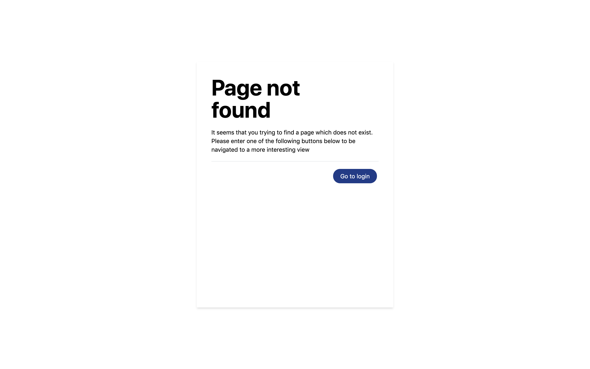
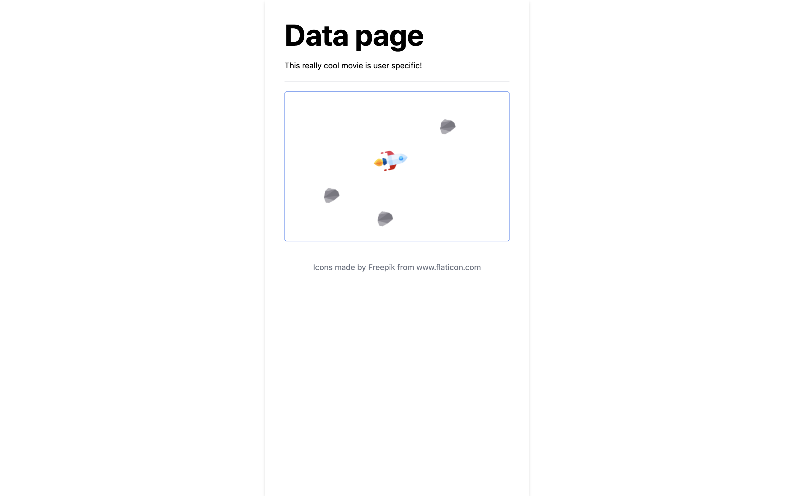
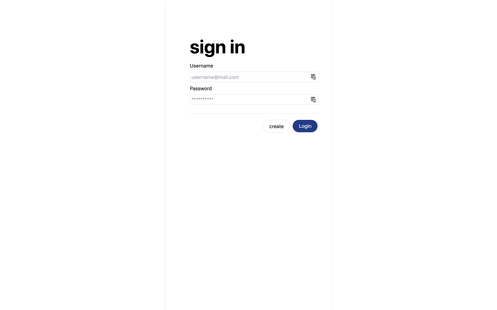

# Empty project

A really small example of a react project which can be used to easily create new project. It is a really simple site with only login, 404 and a small "data" page. It can be use to quickly start a project!

# Views

#### 404 view

#### Data view

#### Sign in view

